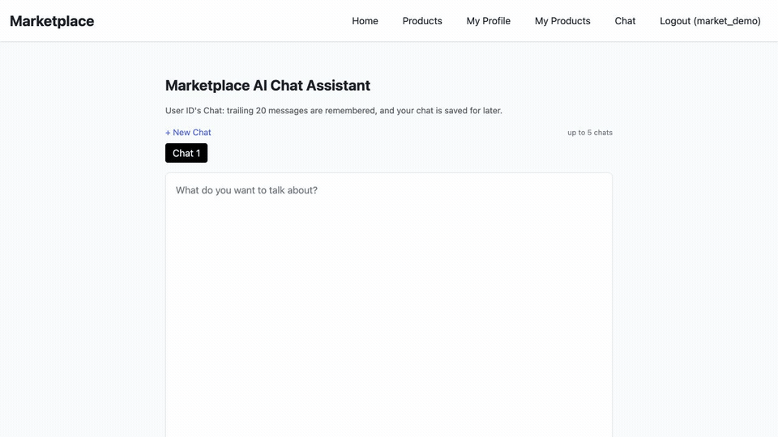
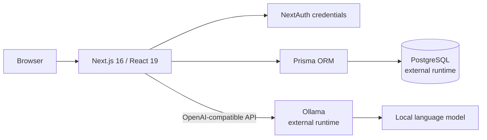

# 🛍️ LLM Market Web App

This repository includes just the skeleton of the prior work.

[](https://nextjs.org/)
[](https://www.postgresql.org/)
[](https://ollama.com/)
[](LICENSE)

[Overview](#overview) · [Architecture](#architecture) · [Capabilities](#capabilities) · [Repository map](#repository-map) · [Engineering choices](#engineering-choices) · [References](#references)



[Open the full-resolution screenshot](docs/assets/chat-demo.png) · [Watch the 19-second MP4](docs/assets/chat-demo.mp4)

## 🎯 Overview

LLM Market Web App brings two familiar product experiences into one compact system:

- a searchable community marketplace with accounts, profiles, listings, images, and owner-controlled editing;
- a multi-session AI chat served through Ollama rather than a paid hosted inference API.

The result demonstrates application design across identity, authorization, relational data, API boundaries, responsive UI, local inference, containerization, and release hygiene—not merely a collection of disconnected examples.

| Engineering surface | What is demonstrated |
| --- | --- |
| Product design | Marketplace discovery and ownership workflows alongside conversational AI |
| Full-stack implementation | Next.js App Router, React, TypeScript, route handlers, NextAuth, Prisma, and PostgreSQL |
| AI integration | OpenAI-compatible client code targeting an independently operated Ollama runtime |
| Data integrity | Explicit relational models for users, products, images, chat sessions, and messages |
| Trust boundaries | Authentication, ownership checks, safe-field selection, input limits, and rate limits |
| Delivery discipline | Multi-stage container build, synthetic evidence, reproducible checks, and sanitized history |

This public artifact preserves the application source, data model, container build, synthetic evidence, and technical decisions while intentionally excluding turnkey operational wiring.

## 🏗️ Architecture



The repository supplies the application source and its production container build. PostgreSQL, Ollama, secrets, network policy, and runtime orchestration remain evaluator-supplied and are not packaged here.

## 🧩 Capabilities

| Product area | Implemented behavior | Evidence |
| --- | --- | --- |
| Marketplace | Create, search, view, edit, and delete listings | Browser-tested in the private local runtime |
| Accounts | Sign up, sign in, sign out, and persistent sessions | Browser-tested in the private local runtime |
| Profiles | Public profile, profile editing, and seller pages | Browser-tested in the private local runtime |
| AI chat | Ollama response generation without a hosted AI key | Browser- and API-tested in the private local runtime |
| Chat memory | Up to five saved chat sessions with persisted messages | Browser-tested in the private local runtime |
| Web container | Multi-stage production Dockerfile | Clean image build verified on Apple Silicon |
| Security baseline | Explicit public fields, bounded inputs, rate limiting, and no default admin | Source- and runtime-reviewed |

## 🗂️ Repository map

```text
.
├── README.md
├── PUBLIC_SNAPSHOT.md
├── SECURITY.md
├── docs/
│   ├── architecture.md
│   ├── verification.md
│   └── assets/          # synthetic screenshot, GIF, and MP4
└── web/
    ├── Dockerfile       # production web-image build only
    ├── prisma/schema.prisma
    ├── src/app/         # pages and route handlers
    ├── src/components/  # product and navigation UI
    └── src/lib/         # auth, database, validation, rate limits
```

## ⚙️ Engineering choices

- **Local-model integration:** the chat path targets Ollama's OpenAI-compatible API without embedding a paid provider key.
- **Relational persistence:** Prisma models users, products, images, chat sessions, and messages explicitly.
- **Deliberate release boundary:** product engineering remains visible while infrastructure recipes and secrets stay private.
- **Evidence over claims:** implemented behavior, private-runtime verification, and public-artifact checks are clearly separated.

## 📚 References

- [Next.js documentation](https://nextjs.org/docs)
- [Prisma documentation](https://www.prisma.io/docs)
- [PostgreSQL documentation](https://www.postgresql.org/docs/)
- [Ollama API documentation](https://docs.ollama.com/api/introduction)
- [Docker documentation](https://docs.docker.com/)
- [NextAuth.js documentation](https://next-auth.js.org/)

## ⚖️ License and attribution

Released under the [MIT License](LICENSE). Third-party libraries, container images, products, models, and trademarks remain subject to their respective licenses and terms. See [NOTICE.md](NOTICE.md).

AI-assisted development tools helped audit, test, sanitize, and document this portfolio snapshot. The repository owner reviewed the released material and remains responsible for it.

**Marketplace workflows, persistent conversations, and local AI—designed as one coherent product.**
